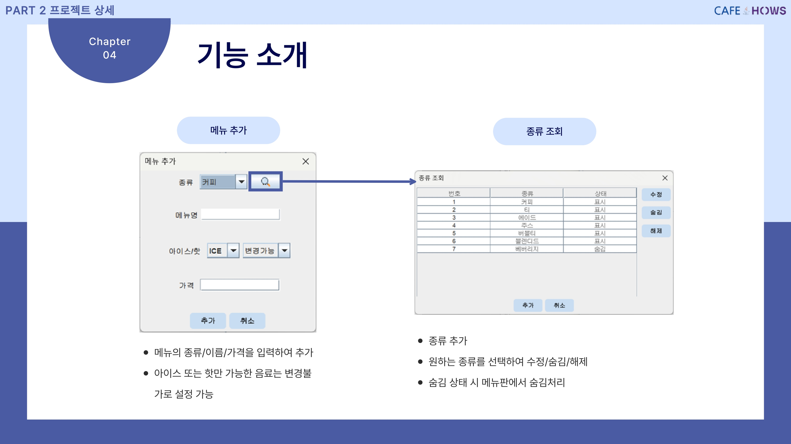

# ☕ CafeHows - Cafe Management System

## 📌 프로젝트 개요

CafeHows는 **카페 점주를 위한 관리 시스템**으로, 효율적인 주문 및 매출 관리 기능을 제공합니다.  
사용자는 메뉴 관리, 고객 관리, 직원 관리 등을 통해 운영의 효율성을 높이고 데이터 기반의 의사 결정을 내릴 수 있습니다.

---

## 🎯 기획 의도

**Insight:**  
카페 점주에게 편리한 기능을 제공하고 매출 상승을 돕는 데이터 기반 카페 관리 프로그램입니다.

### **핵심 기능**
- **Keyword 1:** 메뉴판 표시 및 결제 기능
- **Keyword 2:** 포인트 적립
- **Keyword 3:** 기간별 메뉴 판매량 조회

---

## 📌 프로젝트 소개

### **주요 기능**
✅ **주문 관리:** 결제 및 환불 기능  
✅ **메뉴 관리:** 메뉴 수정, 추가, 숨김/해제  
✅ **고객 관리:** 회원 등록/탈퇴, 포인트 적립 및 사용  
✅ **직원 관리:** 근무 시간 기록 및 조회  
✅ **매출 관리:** 일별, 주별, 월별 매출 조회 및 이윤 계산  

---

## 🛠 개발 환경

| 개발 언어 | 개발 도구 | 데이터베이스 | 협업 툴 |
|-----------|---------|------------|--------|
| Java | Eclipse | MySQL | GitHub |

---

## 🏗 시스템 구조도

CafeHows는 다음과 같은 구조로 설계되었습니다.

```plaintext
메인 화면
│
├── 주문
│   ├── 결제
│   │   ├── 영수증 출력
│   │   └── 주문 내역 저장
│
├── 메뉴 관리
│   ├── 메뉴 추가/수정/숨김
│   ├── 메뉴판 변경
│
├── 고객 관리
│   ├── 장기 미방문 고객 대상 문자 발송
│   ├── 포인트 관리
│
├── 매출 관리
│   ├── 기간별 매출액 조회
│   ├── 기간별 메뉴 판매량 조회
│
└── 직원 관리
    ├── 직원 조회
    ├── 재직 상태 변경
    ├── 근무 기록 관리
```
---
## 📂 ERD (Entity Relationship Diagram)

CafeHows의 데이터베이스 구조는 다음과 같이 설계되었습니다.


---

## 🎨 UI 화면 구성

### **💳 메인 페이지**


---

### **📋 메뉴 관리**



---

### **👥 고객 관리**


---

### **📊 매출 관리**


---

### **👨‍💼 직원 관리**


